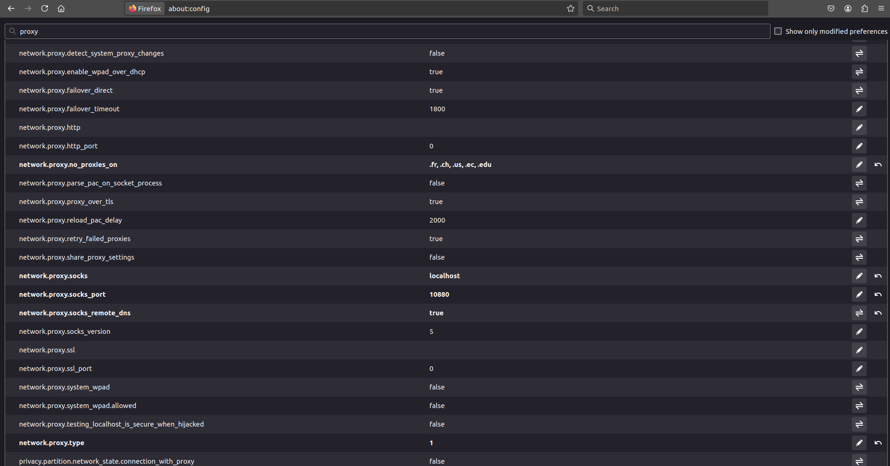

# Proposal for a simple test for remote BRIL shifts (by E. Carrera)

## Context and backgound

The BRIL system at the CMS Experiment is a collection of devices that aim to measure the luminosity at the experimental site and
monitor de beam backgrounds and therefore check on the safety of the rest of the subsystems.

There are two types of shifts that are necessary for the stable operation of the BRIL subsystem:

* The **BRIL desk shifts**: where a person sits in front of a computer and event displays in order to help check the operational goodness of the system. 

* The **BRIL DOC shifts**: where a person carries a cell phone and checks on the performance of the system, and also
answers questions or solve problems realted to the system.

The latter type of shifts can only be done in-situ.  However, the former type, the desk shifts, could be performed remotely.  They
are usually done in the CMS control room, but part of this proposal is to test the factibility that they can be done elsewhere.

In order for the general effort to be taken seriously by the BRIL operations management, we, as personnel of the
Ecuadorian institutes, need to make a honorable pledge to complete these type of shifts with all responsability and
competence, within the full assigned schedule.  We need to figure out the best way in which way we can accomplish this.

I have talked to the operation managers here and they are flexible to our needs.

## Objective

The purpose of this document is to give information about the minimal requirements for performing a simple
test to check the feasibility of carrying on remote BRIL shifts from Ecuador (or any other part of the world, for that matter).

This proposal is due to be done sometime between July 11 and July 14, 2024.  Ideally, it should be done
in the afternoon and evening (CEST time) of July 11 or 12 (that is, during the morning or early afternoon in Ecuador)


## Desk shifts requirements

There are ample [instructions for bril shifting](https://twiki.cern.ch/twiki/bin/view/CMS/BRILShifterInstructions), which should be read eventually.  However, all of this can be a little overwhelming at first.  Rather soon, we plan to give a dedicated mini-workshop locally in Ecuador to make things a bit clearer.

For this simple test, however, I will list the very basic requieremnts needed to check
the connection and the overall idea of the procedure.

### Training requirements:

* Complete the [mandatory courses](https://lms.cern.ch/ekp/servlet/ekp?TX=STRUCTUREDCATALOG&CAT=EKP014046909).  They are online and very easy to complete.  You probably have done them already.  Please check your [Adams](https://apex-sso.cern.ch/pls/htmldb_edmsdb/f?p=404:1:725887956009:::::) profile to make sure.

### Basic technical requirements:

*In the shell commands below, please replace `ecarrera` with you CERN username.

* An account on the online CMS cluster.  I.e., you need an account to access the `cmsusr` [online machines](https://twiki.cern.ch/twiki/bin/view/CMS/ClusterUsersGuide#Network_and_servers).  You can test
whether you have one already by connecting first to `lxplus.cern.ch` and then to `cmsusr` in the following way:

  - Connect first, through ssh, to one of the `lxplus` machines (note that connections to `cmsusr` online machines is not possible directly from outside)
    ```
    ssh -tCXY ecarrera@lxplus.cern.ch
    ```
  - Then, once on `lxplus`, connect to `cmsusr`:
    ```
    ssh -tCXY ecarrera@cmsusr
    ``` 
  The `cmsusr` machines are the gateway to access any online subsystem machines, including BRIL's.  Since we are talking about helping with online operations, we need to access the online infrastructure.  **Treat it with the care that it deserves.  Access to online systems means that errors could turn into operations failure in real time and jeopardize the whole experiment.**

  If you do not have an online account, you have to **request one**.  Follow the instructions [here](https://twiki.cern.ch/twiki/bin/view/CMS/BRILShifterInstructions#Before_your_first_shift) about contacting Arkady (please cc me).

* Make sure you are able to log in as `brilpro` from one of the BRIL servers.  This is needed because there might be some actions that you may need to take, if asked, within the BRIL online cluster. 

  In order to check if you can do that, 
  
  - log into a `cmsusr` machine (as just described above and [here](https://twiki.cern.ch/twiki/bin/view/CMS/BRILShifterInstructions#Before_your_first_shift));

  - once on `cmsusr`, connect to one of the BRIL machines, e.g., `brildev1` (note, this is an alias; the actual name of the machine could be something like `srv-s2d16-29-01` or so):

    ```
    ssh -tCXY ecarrera@brildev1
    ```
  - make yourself `brilpro`, which is a by-default user with the correct privileges to perform certain tasks

    ```
    xsudo -u brilpro --login
    ```
    If you can't do this, i.e., become `brilpro`, please contact Arkady to request access as explained [here](https://twiki.cern.ch/twiki/bin/view/CMS/BRILShifterInstructions#Before_your_first_shift) (please cc me).

* Make sure you can open a browser with tunneled data from the online servers.  This is because, in order to monitor the different data, we need the information from P5 (point 5, the place where CMS is) flowing to our local browser, so it is not too slow, and we can use it to see the relevant displays.

  * For this, you first need to establish a double ssh tunnel by running in a Linux terminal something like:

    ```
    ssh -t ecarrera@lxplus.cern.ch -L 10880:localhost:8089 "ssh -D 8089 ecarrera@cmsusr.cern.ch"
    ```
    This means that you are forwarding some port (8089, in this case) to a local port 10880 (which is in principle arbitrary, i.e., it can be any number that do not interfere with usual port assignments, I guess.)  

    You need to keep this tunnel running, i.e., do not logout from the tunnel while you are performing the monitoring test.  If for some reason it hangs or exits, quit, and just restart it.  No need to close the browser tabs (In the browser that you will be opening later) for this, but you might need to reload them.

    For convenience, I usually execute [this script](resources/cms_connect.sh), which is smart enouch to tell if I am inside or outside the CERN network.  You can clone this and replace my user name with yours.  You just would have to run it like

    ```
    source cms_connect.sh
    ```
  
  * Now, your browser needs to know about this port (10880 or the one you have chosen) in order to pick up the needed data information and be able to acces the `.cms` sites (within the private, online cms network.)  
  
    There are a few methods to do this, as it is explained in the [BrilDAQP5Tunnel Twiki instructions](https://twiki.cern.ch/twiki/bin/view/CMS/BrilDAQP5Tunnel), but I will just copy paste below what has worked for me.

    I am personally using *Firefox*, to mantain things separate from my personal use.  However, other browsers should work as well.  
    
    Keep in mind that while you are tunneled and configured as it is described below, you will be browsing data coming from P5, and not necessarily from local input.

    The following settings need to be done once (on the browser you choose to use) to see `.cms` network addresses. 

    - Open a fresh instance of your preferred browser (I used *Firefox*.)
    
    - In the browser *url* field type `about:config`.  Accept the "risks" disclaimer and continue.

    - In the search window, search for `proxy` and make sure the following values are set for the corresponding parameters:

      ```
      - network.proxy.type value 1
      
      - network.proxy.socks value localhost
      
      - network.proxy.socks_port value 10880
      
      - network.proxy.socks_remote_dns value true
      
      - network.proxy.no_proxies_on add your noproxy whitelist,e.g. localhost,127.0.0.1,.fr,.ch,.us,.gov,.edu
      ```
      Apparently, there are other ways to do the same, as it is discussed [here](https://twiki.cern.ch/twiki/bin/view/CMS/BrilDAQP5Tunnel), but this seemed to have worked for me.

      I attach a screenshot of my configuraton:
      

    I think this is what I do in my *Firefox*.  Although I rarely use firefox, I keep two different *profiles* for this, so I can decide if you start the browser with the *default* profile or the *tunneled* one.  You can google about how to manage different profiles in a given browser to learn more.

* Make sure to subscribe to the [BRILDOC](https://mattermost.web.cern.ch/cms-bril/channels/brildoc) mattermost channel under the [CMS-BRIL](https://mattermost.web.cern.ch/signup_user_complete/?id=awjjwmdshiyadeq9byoxcnfpre&md=link&sbr=su) team.  In addition, it would be good if you also follow the [HFLumi](https://mattermost.web.cern.ch/cms-bril/channels/hflumi), the [BMC1F](https://mattermost.web.cern.ch/cms-bril/channels/bcm1f), the [BCML](https://mattermost.web.cern.ch/cms-bril/channels/bcml), the [PLT](https://mattermost.web.cern.ch/cms-bril/channels/bcm1f), the [BPTX and Clocks](https://mattermost.web.cern.ch/cms-bril/channels/bcm1f), and the [BRILDAQ and online SW](https://mattermost.web.cern.ch/cms-bril/channels/brildaq-and-online-sw) mattermost channels.  These channels are useful at the time of contacting experts for urgent (but not extremely-urgent) business and get help/guidance.  This is all best done using the mattermost desktop application or browser.

* Also, subscribe to the [Run 3: Shifters+Docs](https://mattermost.web.cern.ch/cms-online-ops/channels/mwgr-shifters--docs) mattermost channel under the [CMS Online Ops](https://mattermost.web.cern.ch/signup_user_complete/?id=q5zs7noeejnfmcjpqpm1ueth6a&md=link&sbr=su) team.  This will be the channel where you will interact with the Shift Leader, if necessary.  It is also usefull to check what is going on in the control room.

* Get a [CERN phone number](https://cernphone.docs.cern.ch/) and install and configure the [CERNPhone app](https://cernphone.docs.cern.ch/install_cp/) in your mobile device. Please read the instructions carefully.

  This might be the most crucial requirement because, if something really urgent happens, you will have to call the BRIL DOC shifter right away.  The CERNPhone infrastructure is the most efficient and effective way of doing it.  However, there may be the drawback that one needs to have been at CERN before (i.e, has had to sign a CERN contract) for obatining a CERN number (I am not exactly sure, as I have no way to test it).  Please contact me if you can't create a CERN phone number.


 
## Test proposal

### Time window

CMS has three shift slots of 8 hours each: a morning one from 07H00 to 15H00, an evening one from 15H00 to 23H00 and the so-called *owl* shift from 23H00 to 07H00 next morning.  

BRIL desk shifts are typically assigned locally only during the morning slot.

Europe still switches time schedule in the summer.  During the summer daylight saving window (from  March to October) we have 7 hours difference with Ecuador as clocks in Europe spring forward one hour, whereas there are only 6 hours difference for the rest of the year as clocks are set back to "normal" in the fall.  Therefore, the best time for remote shifts done in the "Americas" should be during the local mornings.  So, currently, for Ecuador, this is:

   * from 08H00 to 16H00 (during the summer: March to October) or 
   * from 09H00 to 17H00 (during the rest of the year)

While this is the schedule in which shifts will be assigned and counted officially, we might need to ask for certain flexibilty. I do not think this will be a problem as long as we state explicitly when we will not be watching the moinitors. When we do this for real, and since we all have to teach or take a class most of the days, I envision that we might need to take a break from our duties.  For instance, if I have to teach from 10 to 12, I will be doing my shift from 8 to 18H, to compensate for the two hour break for teaching duties.  I would bring my lunch to have it in front of the monitors. (I know, this sounds like a lot of work, but we need to take this contributions seriously and carry them on like they do here.)

## Procedure

I will be the BRIL DOC on-call expert from this Thursday 11 of July till Sunday July 14.  The tests can happen at any time but I would rather do them on Thursday or Friday during the CMS evening shift window.

I would recommend a two hour test because in the first hour or at the beginning I can help with any issue or question that may arise and the rest of the time you will be on your own (of course your life will not depend on it).

To start the test please follow this procedure:

1. Make sure you urgently work (you must have this ready for the test with much anticipation.  So if you can settle this by Wednesday, it would be ideal.) on completing all the preliminar requirements discussed above.  Please contact me if you have a problem, something is not as clear or if you need help.

1. Once you are ready, let me know when you will want to do the two-hour test within the 15H to 23H (CERN time) window.

1. To start the test, you need to fire up your *ssh* tunneling and your tunneled intance of your browser.

1. Note that in the control room, as you can see in the regularly-updated [screenshots](https://cmsoms.cern.ch/cms/snapshots/bril) from the "real" BRIL desk in the control room, there are several displays open in 8 different monitors.  We will attempt to open a few of them, the most important ones, according to the [BRIL shifter instructions](https://twiki.cern.ch/twiki/bin/view/CMS/BRILShifterInstructions#What_to_watch_for_during_your_sh).  

1. In the tunneled browser, I need you to open several tabs according to the list and urls below:

   * The [Run Control](http://srv-s2d16-22-01.cms/runcontrol/overview) page: this is probably the only dangerous page we will be opening.  Be careful with this.  You can explore around but do not change or press any button.  You can find instructions for understanding this page [here](https://twiki.cern.ch/twiki/bin/view/CMS/BRILDAQShifterInstructions#BRILDAQ_controls)  I will explain a little at the beginning.

   * The [Webmonitor Summary](http://srv-s2d16-22-01.cms/webmonitor/summary) page: this, and the rest of the Webmonitor pages are safe to fiddle with as they are just copies of the online one.  Play with them as much as you want, and compare them with the live [screenshots](https://cmsoms.cern.ch/cms/snapshots/bril) from the real desk.  Here we will be checking [background numbers](https://twiki.cern.ch/twiki/bin/view/CMS/BRILDOCInstructions#Background_number), and the BPTX [cogging number](https://indico.cern.ch/event/1397359/contributions/5873428/attachments/2840747/4965543/BPTX%20and%20LHC%20Clocks%20-%20Shifter%20training%202024.pdf) mostly.

   * The [Bril snapshots](https://cmsoms.cern.ch/cms/snapshots/bril): just to see the tracking semaphore without having to open DCS pages (we will do this for the real situation later but not for the test.)

   * The [Webmonitor Luminosity](http://srv-s2d16-22-01.cms/webmonitor-backup/lumi): to check the luminosity 

   * The [Webmonitor PLT](http://srv-s2d16-22-01.cms/webmonitor/plt) preset: as an example of how to check individual luminometer channels.

1. In addition, in a tunneled or better in a non-tunneled browser (as these pages are public anyway), I would like you to open:

   * [Mattermost](https://mattermost.web.cern.ch/): our first line of communication

   * The [LHC Page One](https://op-webtools.web.cern.ch/vistar/): to check the LHC machine overall status.

   * The [LHC Operation](https://op-webtools.web.cern.ch/vistar/?usr=LHC3)

   * The [LHC Configuration](https://op-webtools.web.cern.ch/vistar/?usr=LHCCONFIG) page

   * The [Bril Shifter Instructions](https://twiki.cern.ch/twiki/bin/view/CMS/BRILShifterInstructions): for the most basic instructions for desk shifters

   * The [BRIL DOC Instructions](https://twiki.cern.ch/twiki/bin/view/CMS/BRILDOCInstructions): for more in-depth content

   * The [All Shifter Instructions](https://twiki.cern.ch/twiki/bin/view/CMS/AllShifterInstructionsBRIL): for a compiled and searchable Twiki with all the subdetector instructions.

   * The [BRIL Phone List](https://twiki.cern.ch/twiki/bin/viewauth/CMS/BRILPhoneList)

1. Once you have these all up, send me a message in the BRILDOC mattermost channel to let me (and other 80 people) know you are 'initiating the short remote monitoring test' and we can start chatting privately on mattermost or bring up a zoom session.  I can give the details of the zoom session privately then.

1. We will go through a few details for a few minutes (don't worry we will organize a full workshop later) and then you can try to monitor a few things and read the relevant parts of the documentation (and have questions) for an hour or so.

1.  In the middle of your reading.  I would like you to call me to the CERN BRIL DOC phone number, without letting me know before hand, just to test the validity of the CERNPhone infrastructure.

1. After you are done or tired, send another message to the BRILDOC mattermost channel announcing that the short remote monitoring test is over.


